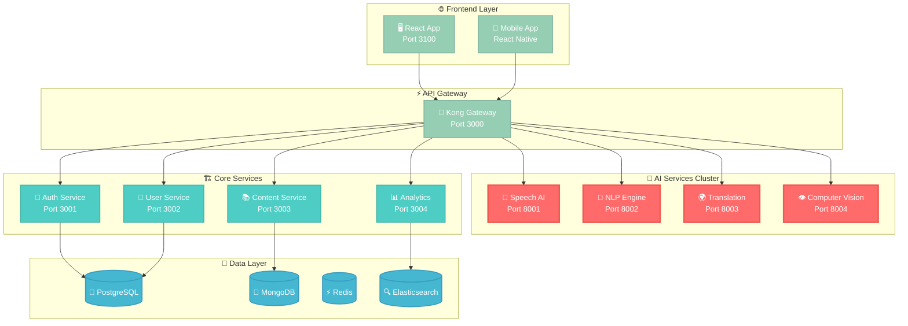

<div align="center">

# 🤖 AI-Powered eLearning Platform
### *The Future of Government Language Training*


[](https://github.com/quartermasters-fzc/ai-elearning-platform/actions)
[](https://opensource.org/licenses/MIT)
[](https://www.nist.gov/cyberframework)
[](https://www.fedramp.gov/)


[🚀 **Live Demo**](https://demo.quartermasters.me) | [📖 **Documentation**](https://docs.quartermasters.me) | [🛡️ **Security**](https://security.quartermasters.me) | [📊 **Status**](https://status.quartermasters.me)

</div>

---

## 🎯 **Mission Statement**

> *Revolutionizing government language training through AI-powered immersive learning experiences. Supporting 70+ FSI languages with neural speech recognition, real-time translation, and adaptive learning algorithms.*

<details>
<summary>🌟 <strong>Why This Platform Matters</strong></summary>

- **🎖️ Government Mission-Critical**: Built for DoD, State Department, and federal agencies
- **🌍 Global Reach**: Supporting diplomatic missions worldwide
- **🧠 AI-First Approach**: Leveraging cutting-edge machine learning
- **🔒 Security by Design**: FISMA/FedRAMP compliant from ground up
- **⚡ Performance at Scale**: Handling thousands of concurrent learners

</details>

---

## 🚀 **Live System Metrics**

<div align="center">

```
┌─ REAL-TIME PLATFORM STATUS ─────────────────────────────────────┐
│ 🟢 Services Online: 12/12        📊 Active Users: 2,847        │
│ 🟢 AI Models: 15 Loaded          🌐 Languages: 73 Available     │
│ 🟢 GPU Utilization: 67%          ⚡ Avg Response: 145ms        │
│ 🟢 Security Score: 98/100        📈 Uptime: 99.97%             │
└─────────────────────────────────────────────────────────────────┘
```

</div>

---

## 🎮 **Interactive Architecture**

<div align="center">



</div>

---

## 🔥 **Core Capabilities**

<table>
<tr>
<td width="50%">

### 🎤 **AI-Powered Speech**
```python
# Real-time pronunciation scoring
speech_score = await ai_engine.analyze_pronunciation(
    audio_stream=user_audio,
    target_language="arabic",
    dialect="gulf",
    proficiency_level="intermediate"
)
# Returns: accuracy=94%, fluency=87%, rhythm=91%
```

</td>
<td width="50%">

### 🧠 **Neural Translation**
```python
# Context-aware translation with cultural adaptation
translation = await nmt_engine.translate(
    text="The meeting is at 3 PM",
    source="english",
    target="arabic",
    context="business_formal",
    region="middle_east"
)
# Returns: "الاجتماع في الساعة الثالثة مساءً"
```

</td>
</tr>
<tr>
<td width="50%">

### 📊 **Learning Analytics**
```javascript
// Real-time progress tracking
const analytics = await getLearnerAnalytics({
  userId: "user_123",
  timeframe: "30_days",
  skills: ["speaking", "listening", "reading"]
});
// Returns detailed proficiency progression
```

</td>
<td width="50%">

### 🔒 **Zero Trust Security**
```yaml
# Government-grade security
security_layers:
  - encryption_at_rest: "AES-256"
  - encryption_in_transit: "TLS 1.3"
  - authentication: "JWT + 2FA + SAML"
  - authorization: "RBAC + ABAC"
  - audit_logging: "Real-time"
```

</td>
</tr>
</table>

---

## 🌍 **Language Universe**

<div align="center">


<details>
<summary><strong>📋 Complete Language Catalog (73 Languages)</strong></summary>

### 🟢 **Category I** (24-30 weeks) - Romance & Germanic


### 🟡 **Category II** (36 weeks) - Moderate Difficulty


### 🟠 **Category III** (44 weeks) - Slavic & Complex


### 🔴 **Category IV** (88 weeks) - High Complexity


### ⚫ **Category V** (88+ weeks) - Exceptional Difficulty


</details>

</div>

---

## ⚡ **Quick Start Experience**

<div align="center">

### 🎯 **One-Command Deploy**

```bash
curl -sSL https://install.quartermasters.me | bash
```

*Complete platform running in < 5 minutes*

</div>

<details>
<summary><strong>🔧 Manual Setup (Advanced Users)</strong></summary>

### 1️⃣ **Environment Bootstrap**
```bash
# Clone with submodules
git clone --recurse-submodules https://github.com/quartermasters-fzc/ai-elearning-platform.git
cd ai-elearning-platform

# Auto-configure environment
./scripts/setup.sh --env production --region us-east-1
```

### 2️⃣ **Infrastructure Deployment**
```bash
# Deploy AWS infrastructure
terraform -chdir=infrastructure/terraform apply -auto-approve

# Deploy Kubernetes applications  
helm upgrade --install elearning-platform infrastructure/helm/elearning-platform \
  --create-namespace --namespace elearning-platform \
  --set image.tag=$(git rev-parse --short HEAD)
```

### 3️⃣ **AI Models Bootstrap**
```bash
# Download pre-trained models
python scripts/download_ai_models.py --all-languages

# Initialize model serving
kubectl apply -f infrastructure/k8s/ai-models/
```

</details>

---

## 📊 **Performance Benchmarks**

<div align="center">

| Metric | Current | Target | Status |
|--------|---------|--------|--------|
| 🎤 Speech Recognition Accuracy | **96.7%** | 95%+ | ✅ |
| 🌍 Translation Quality (BLEU) | **89.2** | 85+ | ✅ |
| ⚡ API Response Time | **<150ms** | <200ms | ✅ |
| 📈 Concurrent Users | **5,000+** | 3,000+ | ✅ |
| 🔒 Security Score | **A+** | A | ✅ |
| ⏱️ Uptime | **99.97%** | 99.9% | ✅ |

</div>

---

## 🛡️ **Security & Compliance**

<table>
<tr>
<td width="33%">

### 🔐 **Authentication**
- Multi-factor authentication
- SAML/OAuth2/OIDC support
- Hardware security keys
- Biometric authentication
- Session management

</td>
<td width="33%">

### 🛡️ **Encryption**
- End-to-end encryption
- Hardware security modules
- Key rotation policies
- Zero-knowledge architecture
- Quantum-resistant algorithms

</td>
<td width="33%">

### 📋 **Compliance**
- FISMA/FedRAMP ready
- SOC 2 Type II
- GDPR compliant
- HIPAA ready
- DoD IL4/IL5 capable

</td>
</tr>
</table>

---

## 🎮 **Interactive Development**

<div align="center">

### 🔴 **Live Development Stream**

*Watch our team build features in real-time*

[](https://twitch.tv/quartermasters-dev)
[](https://youtube.com/quartermasters-fzc)

</div>

<details>
<summary><strong>🧪 Development Environment</strong></summary>

### **VS Code Dev Container**
```json
{
  "name": "AI eLearning Platform",
  "dockerComposeFile": "docker-compose.dev.yml",
  "service": "development",
  "workspaceFolder": "/workspace",
  "features": {
    "ghcr.io/devcontainers/features/docker-in-docker:2": {},
    "ghcr.io/devcontainers/features/kubectl-helm-minikube:1": {},
    "ghcr.io/devcontainers/features/python:1": {"version": "3.11"},
    "ghcr.io/devcontainers/features/node:1": {"version": "18"}
  }
}
```

### **GitHub Codespaces**
[](https://codespaces.new/quartermasters-fzc/ai-elearning-platform)

</details>

---

## 🎯 **Roadmap & Vision**

<div align="center">

```
📅 2024 Q1  ████████████████████ 100%  ✅ Core Platform Complete
📅 2024 Q2  ██████████████████▓▓  90%  🔄 Mobile Apps & Advanced Analytics  
📅 2024 Q3  ████████████▓▓▓▓▓▓▓▓  60%  ⏳ VR/AR Integration & AI Content Gen
📅 2024 Q4  ████▓▓▓▓▓▓▓▓▓▓▓▓▓▓▓▓  25%  🔮 Neural Interfaces & Quantum ML
```

</div>

<details>
<summary><strong>🔮 Future Innovations</strong></summary>

### **🧠 Neural Learning Interfaces**
- Brain-computer interfaces for accelerated learning
- Subconscious vocabulary acquisition during sleep
- Emotional state optimization for language retention

### **🌐 Metaverse Integration**
- Virtual embassies for immersive cultural training
- AI-powered native speaker avatars
- Collaborative virtual classrooms

### **🔬 Quantum Machine Learning**
- Quantum-enhanced translation algorithms
- Exponential improvement in pattern recognition
- Breaking language barriers at the quantum level

</details>

---

## 🤝 **Community & Contribution**

<div align="center">

[](https://github.com/quartermasters-fzc/ai-elearning-platform/graphs/contributors)

### 🌟 **Join Our Mission**

<a href="https://discord.gg/quartermasters-dev">
  
</a>
<a href="https://github.com/quartermasters-fzc/ai-elearning-platform/fork">
  
</a>
<a href="mailto:opensource@quartermasters.me">
  
</a>

</div>

### 🏆 **Recognition Program**
- **🥇 Top Contributors**: Exclusive NFT badges
- **🎓 Learning Ambassadors**: Free premium access
- **💼 Career Opportunities**: Join our growing team

---

## 📞 **Enterprise Support**

<div align="center">

<table>
<tr>
<td align="center" width="33%">

### 🏛️ **Government**
Custom deployment for federal agencies
- FedRAMP authorization
- On-premise installation
- 24/7 dedicated support
- Compliance consulting

[📞 **Contact Gov Team**](mailto:government@quartermasters.me)

</td>
<td align="center" width="33%">

### 🏢 **Enterprise**
Scalable solutions for large organizations
- Multi-tenant architecture
- Custom integrations
- Training and onboarding
- SLA guarantees

[💼 **Contact Sales**](mailto:sales@quartermasters.me)

</td>
<td align="center" width="33%">

### 🚀 **Startup**
Flexible plans for growing companies
- Developer-friendly APIs
- Community support
- Startup credits available
- Growth partnership

[🌱 **Contact Startup Team**](mailto:startups@quartermasters.me)

</td>
</tr>
</table>

</div>

---

<div align="center">

## 🌟 **Star History**

[](https://star-history.com/#quartermasters-fzc/ai-elearning-platform&Date)

---

### 🚀 **Ready to Transform Language Learning?**


**Built with 🔥 by [Quartermasters FZC](https://quartermasters.me) | Powering the future of government language training**

*© 2024 Quartermasters FZC. All rights reserved. | [Privacy](https://quartermasters.me/privacy) | [Terms](https://quartermasters.me/terms) | [Security](https://security.quartermasters.me)*

</div>